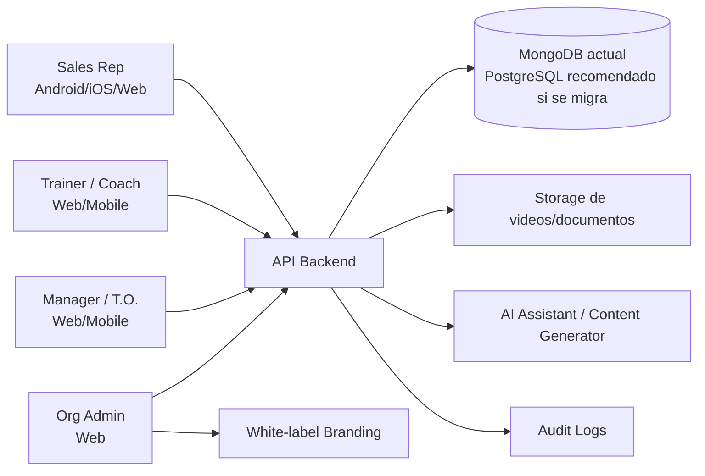
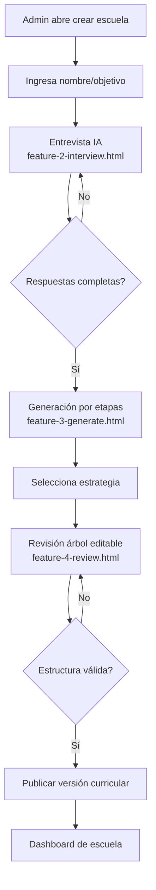
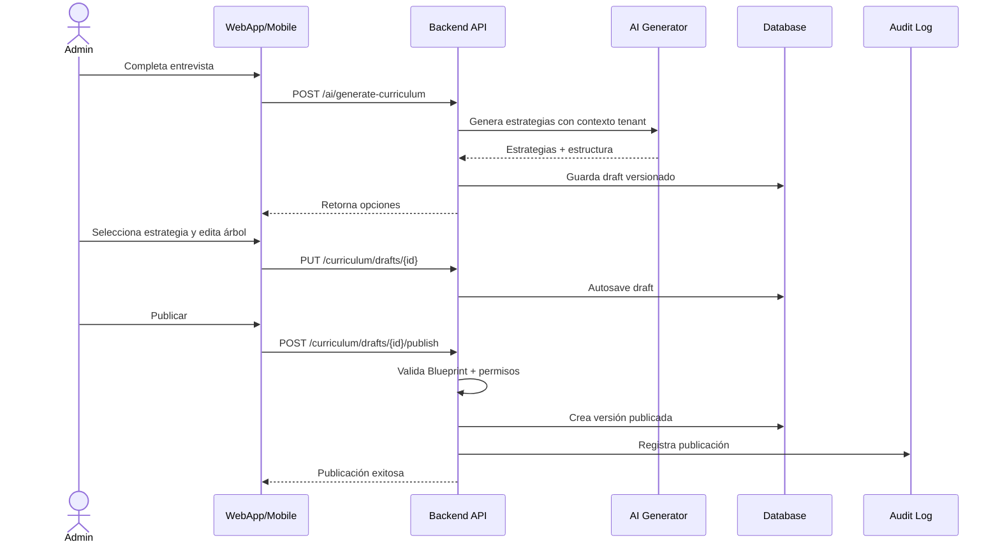
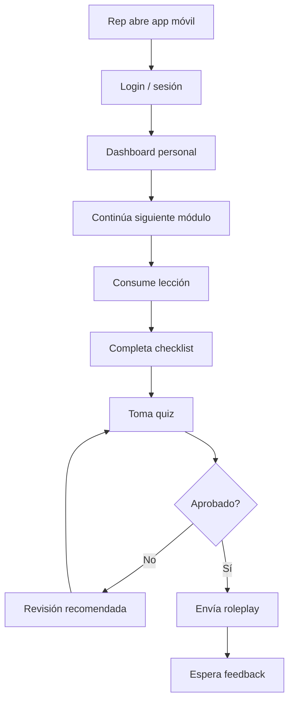
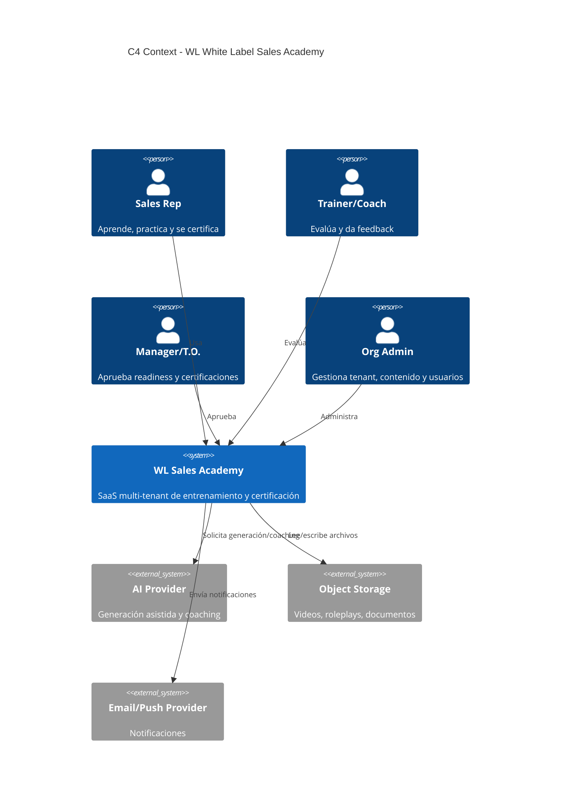
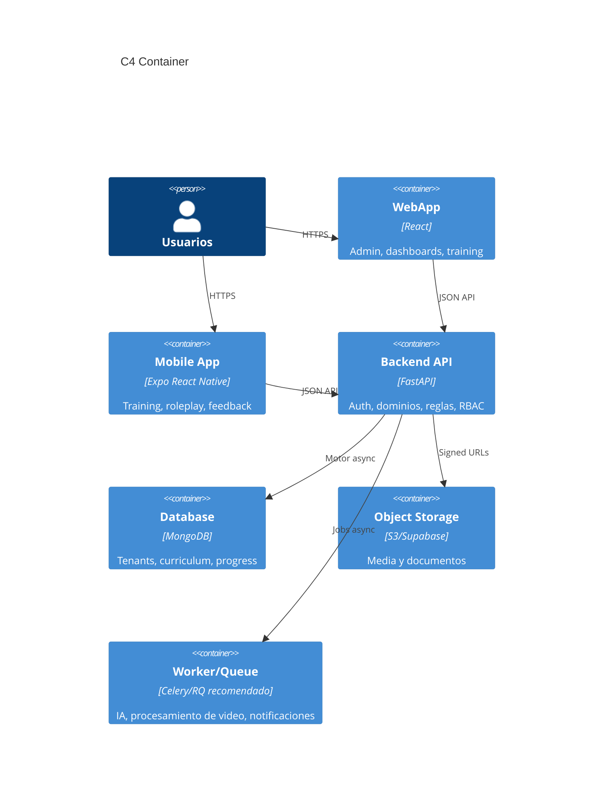
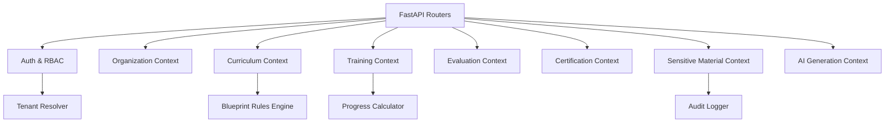
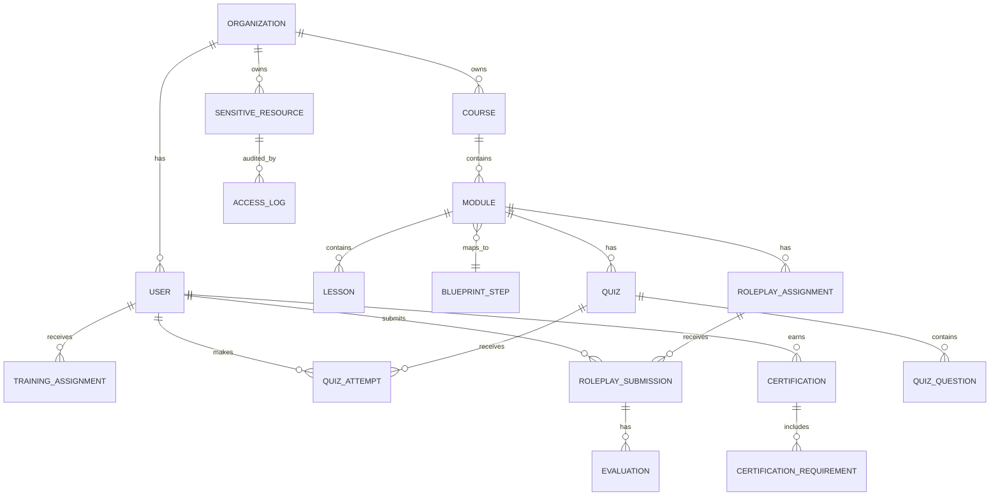

# WL | White Label Sales Academy - SRS y Wiki Técnica

Versión: 1.0  
Fecha: 2026-04-29  
Autor: Arquitectura Técnica / Análisis de Requisitos  
Alcance: app multiplataforma Android, iOS y WebApp  
Repositorio analizado: `/Users/newproject/Documents/GitHub/vcsAcademy`

## Referencia Visual Analizada

Las pantallas de referencia principales se encuentran en:

| Pantalla | Archivo | Propósito funcional inferido |
|---|---|---|
| Entrevista IA de onboarding | `frontend/mockups/feature-2-interview.html` | Capturar contexto de escuela mediante conversación guiada, opciones seleccionables, progreso y generación posterior. |
| Generación automática | `frontend/mockups/feature-3-generate.html` | Mostrar estado de generación, progreso por etapas y seleccionar estrategia generada. |
| Revisión humana | `frontend/mockups/feature-4-review.html` | Revisar, editar, agregar, eliminar, expandir/contraer y publicar la estructura generada. |

Las carpetas `vcsAcademy-detailed-clean/frontend/mockups` y `vcsAcademy-share-complete/frontend/mockups` contienen copias equivalentes de estas pantallas; por tanto, se toma `frontend/mockups` como fuente visual canónica.

---

# 1. Documento de Especificación de Requisitos de Software (SRS)

## 1.1 Introducción

### Propósito

Este documento especifica los requisitos funcionales, no funcionales, de datos, interfaces, seguridad, arquitectura y testing para **WL | White Label Sales Academy**, una plataforma white-label de entrenamiento, roleplay, evaluación y certificación comercial basada en el **Blueprint of the Sale**.

El documento sirve como contrato verificable para producto, diseño, ingeniería, QA, seguridad y stakeholders operativos.

### Alcance del Producto

#### In Scope

- WebApp administrativa y de entrenamiento.
- App móvil Android e iOS para representantes, entrenadores y managers.
- Plataforma multi-tenant white-label por organización.
- Branding configurable por organización.
- Onboarding asistido por IA para crear la academia.
- Generación asistida de estructura de cursos, módulos y lecciones.
- Revisión humana antes de publicar contenido generado.
- Currículo basado en el Blueprint oficial de ventas.
- Módulos, lecciones, scripts, talk tracks, checklists, quizzes, roleplays y certificaciones.
- Dashboards para representante, trainer/coach, manager/T.O. manager y admin.
- Control de acceso por roles y tenant.
- Protección de material sensible como precios, incentivos, programas, fees y documentos internos.
- Auditoría de accesos sensibles cuando la arquitectura lo soporte.
- UX responsive con fidelidad a mockups, incluyendo estados mobile-first.
- Operación offline parcial en móvil para contenido previamente descargado, cuando sea viable por fase.

#### Out of Scope

- Procesamiento legal de contratos de venta reales.
- Motor contable o CRM completo.
- Gestión de pagos de clientes finales del resort.
- Sustitución de aprobación legal/compliance de scripts oficiales.
- Publicación de pricing real sin datos autorizados.
- Generación de beneficios oficiales no provistos por material aprobado.
- LMS genérico desacoplado del Blueprint.

### Definiciones, Acrónimos y Abreviaturas

| Término | Definición |
|---|---|
| WL | White Label, instancia personalizada para una organización. |
| VCSA | Vacation/Sales Club Academy, base histórica del repo. |
| Blueprint | Proceso oficial de venta en orden obligatorio. |
| Rep | Sales Representative. |
| Trainer/Coach | Usuario que crea, asigna y evalúa entrenamiento. |
| Manager/T.O. Manager | Usuario que revisa progreso, Point of Confirmation y Turn Over. |
| Admin | Usuario que administra contenido, usuarios, permisos y configuración. |
| T.O. | Turn Over, transferencia al manager. |
| FORM | Family, Occupation, Recreation, Motivation. |
| RBAC | Role-Based Access Control. |
| Tenant | Organización white-label aislada. |
| SRS | Software Requirements Specification. |
| ADR | Architecture Decision Record. |

### Referencias

- `AGENTS.md`: reglas del producto, Blueprint, compliance y definición de terminado.
- `frontend/mockups/feature-2-interview.html`
- `frontend/mockups/feature-3-generate.html`
- `frontend/mockups/feature-4-review.html`
- `frontend/src/pages/InterviewPage.jsx`
- `frontend/src/pages/GeneratePage.jsx`
- `frontend/src/pages/ReviewPage.jsx`
- `backend/server.py`
- `backend/organization_models.py`
- `backend/school_routes.py`
- `obsidian-super-wiki/08 - Data, Auth & Roles.md`

### Preguntas Pendientes al Product Owner

- ¿El nombre comercial final será `WL | White Label Sales Academy`, `VCSA`, o ambos según contexto?
- ¿Qué material del Blueprint se considera "oficial aprobado" y quién lo valida?
- ¿Qué jurisdicciones legales aplican para privacidad, grabaciones de roleplay y contenido de ventas?

## 1.2 Descripción General

### Perspectiva del Producto

WL | White Label Sales Academy es una plataforma SaaS multi-tenant que combina entrenamiento estructurado, práctica guiada, IA asistida, revisión humana y certificación. El sistema actual del repo usa WebApp React, backend FastAPI y MongoDB, con una app móvil Expo/React Native existente. Para la estrategia multiplataforma se recomienda mantener una API común y evolucionar hacia dominios compartidos, contratos tipados y diseño system consistente.



### Funciones Principales del Producto

- Crear una escuela white-label con branding, nombre, audiencia y objetivos.
- Realizar entrevista IA para definir estructura y estrategia.
- Generar una propuesta de cursos/módulos/lecciones.
- Permitir revisión humana editable antes de publicación.
- Gestionar currículo basado en Blueprint.
- Asignar módulos y rutas de certificación a reps.
- Registrar progreso, quizzes, roleplays, feedback y aprobaciones.
- Controlar acceso a contenido sensible por rol, tenant y permisos explícitos.
- Proveer dashboards por rol.
- Mantener trazabilidad de cumplimiento y fee disclosure.

### User Personas

| Persona | Objetivo | Necesidades clave |
|---|---|---|
| Sales Rep | Aprender y practicar el Blueprint completo. | Ruta clara, progreso, scripts, roleplay, feedback, certificación. |
| Trainer/Coach | Entrenar, evaluar y corregir reps. | Rubricas, revisión de roleplays, notas, asignaciones y skill gaps. |
| Manager/T.O. Manager | Validar preparación operativa y T.O. | Vista de equipo, readiness, handoff notes, approvals. |
| Org Admin | Administrar academia white-label. | Usuarios, branding, contenido, permisos, auditoría, settings. |
| System Admin | Operar la plataforma SaaS. | Tenants, límites, planes, monitoreo y soporte. |

### Entorno Operativo

| Plataforma | Requisitos |
|---|---|
| WebApp | Navegadores modernos Chrome, Edge, Safari, Firefox. Diseño responsive desktop/tablet/mobile. |
| Android | App Expo/React Native, Android soportado por Expo SDK vigente. |
| iOS | App Expo/React Native, iOS soportado por Expo SDK vigente. |
| Backend | FastAPI actual; API versionada; despliegue Docker/VPS/Vercel-adjacent según estrategia. |
| Base de datos | MongoDB actual; diseño preparado para migración relacional si se adopta PostgreSQL/Prisma. |

### Restricciones y Suposiciones

- La secuencia del Blueprint no puede alterarse.
- Material sensible debe estar protegido por servidor, no solo por UI.
- IA no publica contenido final sin revisión humana para material de entrenamiento oficial.
- Pricing e incentivos reales requieren fuente autorizada.
- La app móvil debe consumir la misma API y permisos que la WebApp.
- La experiencia visual debe respetar la estética premium oscura, glass panels, gradientes discretos y tarjetas de los mockups.

### Preguntas Pendientes al Product Owner

- ¿La app móvil necesita operación offline completa o solo lectura offline de contenido descargado?
- ¿Qué roles exactos deben poder crear contenido generado por IA?
- ¿Se requiere aprobación legal/compliance formal antes de publicar módulos con pricing/fees?

## 1.3 Requisitos Específicos

### Requisitos Funcionales

#### RF-001 Multi-Tenant White Label

| ID | Requisito | Criterio verificable | Mockup |
|---|---|---|---|
| RF-001.1 | El sistema debe permitir crear una organización/escuela con nombre, slug, logo, colores, idioma, zona horaria y settings. | Dado un admin, cuando crea escuela válida, entonces se persiste `organization_id`, `slug` único y branding. | Entrevista IA, header `Mi Academia`. |
| RF-001.2 | Cada usuario, curso, progreso, roleplay y documento sensible debe pertenecer a un tenant. | Las consultas de API filtran por tenant y rechazan acceso cruzado. | N/A |
| RF-001.3 | La WebApp y la app móvil deben renderizar el branding del tenant. | Colores, logo y nombre cambian al iniciar sesión o seleccionar tenant. | Todas las pantallas. |

#### RF-002 Onboarding Conversacional IA

Pantalla: `frontend/mockups/feature-2-interview.html`

| ID | Requisito | Criterio verificable |
|---|---|---|
| RF-002.1 | La app debe mostrar una entrevista conversacional con mensajes IA, mensajes usuario y opciones seleccionables. | Opciones aparecen como tarjetas; al seleccionar se agrega respuesta de usuario y avanza el flujo. |
| RF-002.2 | Debe existir indicador de progreso con pregunta actual, total y porcentaje. | En pregunta 3 de 4 se muestra 75%. |
| RF-002.3 | Debe soportar opciones de formato: video, texto e híbrido. | La opción seleccionada queda marcada visualmente y persistida. |
| RF-002.4 | Debe mostrar estado de escritura del asistente. | Se renderizan puntos animados mientras se calcula la siguiente pregunta. |
| RF-002.5 | Debe permitir reiniciar entrevista. | "Empezar de nuevo" borra respuestas locales y vuelve a pregunta 1. |
| RF-002.6 | Debe permitir generar academia al completar el set mínimo. | "Generar mi escuela ahora" solo se habilita cuando respuestas obligatorias están completas. |
| RF-002.7 | En contexto WL Sales Academy, la entrevista debe priorizar Blueprint, roles, contenido sensible, idioma, modalidad y audiencia. | Las respuestas generan un `SchoolBlueprint` con campos auditables. |

#### RF-003 Generación Automática y Selección de Estrategia

Pantalla: `frontend/mockups/feature-3-generate.html`

| ID | Requisito | Criterio verificable |
|---|---|---|
| RF-003.1 | La app debe mostrar una generación por etapas: análisis, estructura y optimización. | Se visualiza etapa actual, barra de progreso e indicadores. |
| RF-003.2 | Al finalizar, debe mostrar tres estrategias comparables. | Cards: Agresiva, Equilibrada, Conservadora, con highlights y métricas. |
| RF-003.3 | La estrategia recomendada debe destacarse visualmente sin impedir elegir otra. | "Recomendado" aparece en estrategia equilibrada por defecto o según reglas. |
| RF-003.4 | Seleccionar estrategia debe persistir preset, estructura y navegación a revisión. | Se guarda `selectedStrategy` y `generatedStructure`. |
| RF-003.5 | Debe existir opción de regenerar. | Se reinicia animación y se crean nuevas alternativas versionadas. |
| RF-003.6 | Para Blueprint oficial, ninguna estrategia puede eliminar pasos obligatorios. | Validación falla si la estructura no cubre los pasos canónicos en orden. |

#### RF-004 Revisión Humana Editable

Pantalla: `frontend/mockups/feature-4-review.html`

| ID | Requisito | Criterio verificable |
|---|---|---|
| RF-004.1 | La app debe mostrar árbol jerárquico Escuela > Cursos > Módulos > Lecciones. | Cada nodo muestra icono, label de tipo y nombre editable. |
| RF-004.2 | El usuario autorizado debe poder expandir/contraer nodos. | Chevron actualiza estado visual y conserva estado durante sesión. |
| RF-004.3 | El usuario autorizado debe editar nombres y descripciones inline. | Guardar valida campos; cancelar revierte cambios no guardados. |
| RF-004.4 | El usuario autorizado debe agregar cursos, módulos y lecciones. | Botón `+` crea hijo permitido según tipo. |
| RF-004.5 | El usuario autorizado debe eliminar cursos, módulos y lecciones con confirmación. | No se permite eliminar escuela raíz; eliminaciones sensibles requieren confirmación. |
| RF-004.6 | Debe existir autosave con estado visible. | Header muestra "Guardando..." y "Guardado automáticamente". |
| RF-004.7 | Debe mostrar cards de conteo: escuela, cursos, módulos, lecciones. | Los contadores se actualizan con cambios en árbol. |
| RF-004.8 | Publicar debe crear versión inmutable del currículo. | Después de publicar se crea `curriculum_version` y se registra auditoría. |

#### RF-005 Currículo Blueprint of the Sale

| ID | Requisito | Criterio verificable |
|---|---|---|
| RF-005.1 | El sistema debe mantener la secuencia canónica de 11 pasos. | Test de orden compara `blueprint_steps.sort_order` contra la lista oficial. |
| RF-005.2 | Los módulos extendidos pueden mapearse a pasos canónicos sin romper orden. | First Visit Incentives, Home Away y Pricing deben mapearse a pasos del Blueprint o extensiones autorizadas. |
| RF-005.3 | Cada módulo debe incluir propósito, comportamientos, lenguaje/talk track, errores comunes, práctica y evaluación. | API rechaza publicación de módulo obligatorio incompleto. |
| RF-005.4 | Discovery debe enfatizar preguntas abiertas, niveles de pregunta y decisores. | Checklist y quiz contienen criterios configurados. |
| RF-005.5 | Wall Tour/Pricing/Fees debe incluir disclosure obligatorio. | UI muestra disclaimer y backend exige `fee_disclosure_acknowledged`. |

#### RF-006 Entrenamiento, Progreso y Certificación

| ID | Requisito | Criterio verificable |
|---|---|---|
| RF-006.1 | El rep debe ver ruta asignada, progreso y siguiente lección. | Dashboard muestra porcentaje y CTA "Continue Training". |
| RF-006.2 | El rep debe completar lecciones, checklists y quizzes. | Progreso se actualiza solo tras eventos válidos. |
| RF-006.3 | Quizzes deben registrar intento, score, aprobado/reprobado y feedback. | Intentos quedan vinculados a user, quiz y tenant. |
| RF-006.4 | Roleplays deben aceptar texto, audio o video según configuración. | Submission se valida, almacena y queda pendiente de revisión. |
| RF-006.5 | Certificación requiere completar módulos, score mínimo, roleplays aprobados y manager sign-off. | La API no emite certificado si falta condición. |

#### RF-007 Dashboards por Rol

| Actor | Requisitos clave |
|---|---|
| Sales Rep | Ver certificación, módulos asignados, quizzes, roleplays, feedback, Blueprint progress y próximos pasos. |
| Trainer/Coach | Ver reps asignados, roleplays pendientes, skill gaps, notas y recomendaciones. |
| Manager/T.O. | Ver readiness por equipo, Point of Confirmation, T.O. readiness, pasos débiles y aprobaciones. |
| Admin | Ver usuarios, roles, contenido, permisos sensibles, auditoría, branding y analítica general. |

#### RF-008 Seguridad de Contenido Sensible

| ID | Requisito | Criterio verificable |
|---|---|---|
| RF-008.1 | Pricing, incentives, fees y documentos internos requieren permisos explícitos. | Usuario sin permiso recibe 403 desde servidor. |
| RF-008.2 | Todo acceso sensible debe registrar audit log cuando esté habilitado. | Registro contiene user, tenant, recurso, acción, fecha, IP/user agent. |
| RF-008.3 | La UI debe etiquetar contenido como entrenamiento, ejemplo u oficial aprobado. | Badge visible y metadata persistida. |
| RF-008.4 | No se deben mostrar precios reales si no existe fuente autorizada. | Se muestran placeholders y disclaimer. |

### Requisitos No Funcionales

| Categoría | Requisito testeable |
|---|---|
| Performance | WebApp debe cargar dashboard inicial en menos de 3s p95 en red 4G razonable con datos cacheables. |
| Mobile | Pantallas críticas deben responder a 360px de ancho sin solapamientos ni texto truncado crítico. |
| Escalabilidad | API debe soportar multi-tenant con índices por `organization_id`, `user_id`, `status` y `created_at`. |
| Disponibilidad | Objetivo MVP: 99.5%; producción enterprise: 99.9%. |
| Seguridad | Autorización server-side obligatoria; cookies/token seguros; rate limiting en auth e IA. |
| Usabilidad | Flujos principales deben completarse con máximo 5 pasos visibles por tarea crítica. |
| Accesibilidad | WCAG 2.1 AA para contraste, labels, navegación por teclado y screen readers. |
| Observabilidad | Logs estructurados, errores Sentry, métricas API y trazas de tareas IA. |
| Mantenibilidad | Dominios separados por bounded context; reglas de negocio testeadas en servicios. |
| Compatibilidad | Web, iOS y Android comparten contratos de API y diseño system. |

### Requisitos de Interfaces

#### WebApp

- Layout responsive.
- Componentes reutilizables de cards, badges, progress, tabs, dialogs, tree view y chat.
- Fidelidad visual a mockups: fondo oscuro premium, glass panels, gradientes morado/azul, estados hover y animaciones discretas.
- Evitar textos explicativos innecesarios dentro de la UI; priorizar CTAs claros.

#### Mobile Android/iOS

- Navegación con tabs/stack según rol.
- Uso de safe areas.
- Acciones primarias thumb-friendly.
- Soporte de push notifications para asignaciones, feedback y approvals.
- Reproductor de video/audio y carga de roleplay optimizados para móvil.

#### API

Endpoints sugeridos, versionados:

```text
POST   /api/v1/auth/login
GET    /api/v1/me
GET    /api/v1/organizations/current
POST   /api/v1/schools
POST   /api/v1/onboarding/interview
POST   /api/v1/ai/generate-curriculum
PUT    /api/v1/curriculum/drafts/{draftId}
POST   /api/v1/curriculum/drafts/{draftId}/publish
GET    /api/v1/blueprint/steps
GET    /api/v1/training/assignments
POST   /api/v1/progress/events
POST   /api/v1/quizzes/{quizId}/attempts
POST   /api/v1/roleplays/submissions
POST   /api/v1/evaluations/{submissionId}
POST   /api/v1/certifications/{userId}/approve
GET    /api/v1/audit-logs
```

### Requisitos de Datos

- Todos los documentos principales deben incluir `organization_id`.
- Entidades versionables: curriculum, modules, lessons, scripts, rubrics, quizzes.
- Entidades auditables: sensitive resources, pricing materials, fee disclosures, roleplay reviews, certification approvals.
- Progreso debe registrarse como eventos para permitir recalculo.
- Contenido generado por IA debe almacenar prompt/contexto mínimo, modelo/proveedor si aplica, versión generada, usuario y fecha.

### Preguntas Pendientes al Product Owner

- ¿Qué campos exactos son obligatorios para publicar cada tipo de módulo?
- ¿Qué score mínimo certifica a un representante?
- ¿Cuáles documentos deben considerarse material sensible desde MVP?

## 1.4 Otros Requisitos

### Legales y Cumplimiento

- Obtener consentimiento explícito para grabaciones de roleplay.
- Aplicar retención y eliminación de grabaciones según política de la organización.
- Diferenciar entrenamiento de material legal/contractual.
- No representar ejemplos como términos vinculantes.
- Registrar acceso a pricing, fees, incentives y programas.
- Mantener disclosure claro de fees en módulos relacionados.

### Internacionalización

- Idiomas iniciales recomendados: español e inglés.
- Todo texto UI debe usar llaves i18n.
- Contenido curricular debe soportar traducción por tenant y versión.
- Fechas, moneda y zona horaria deben depender del tenant.

### Preguntas Pendientes al Product Owner

- ¿El contenido oficial estará en español, inglés o ambos desde el MVP?
- ¿Se requiere firma electrónica de disclaimers o basta con checkbox/audit log?

---

# 2. Wiki Completa del Proyecto

## A. Lógica de Negocio

### Reglas de Negocio Clave

| ID | Regla |
|---|---|
| RN-001 | La secuencia canónica de Blueprint contiene 11 pasos y no puede reordenarse. |
| RN-002 | Los módulos extendidos deben mapearse a un paso canónico o declararse como extensión aprobada. |
| RN-003 | Un rep no puede certificarse si no completa módulos requeridos, quizzes, roleplays y manager sign-off. |
| RN-004 | Pricing, incentives y fees no se muestran sin permisos y disclosure. |
| RN-005 | La IA puede proponer estructura, pero contenido oficial requiere revisión humana. |
| RN-006 | Todo dato operativo queda aislado por tenant. |
| RN-007 | Trainers evalúan; managers certifican o aprueban readiness según política. |
| RN-008 | Client-respect y full disclosure son reglas de compliance del entrenamiento. |
| RN-009 | El sistema debe involucrar a todos los decisores como criterio entrenable en Discovery. |
| RN-010 | El Point of Confirmation no equivale al Turn Over completo. |

### Modelo de Dominio

#### Agregados Principales

| Agregado | Entidades internas | Invariantes |
|---|---|---|
| Organization | Branding, Settings, Limits, Domains | Slug único, tenant activo, límites respetados. |
| Curriculum | Courses, Modules, Lessons, BlueprintMappings | Orden Blueprint válido antes de publicar. |
| TrainingAssignment | AssignedModules, DueDates, Requirements | Solo trainers/managers/admins pueden asignar. |
| Progress | CompletionEvents, QuizAttempts, ChecklistStatus | Progreso recalculable desde eventos. |
| Roleplay | Assignment, Submission, Evaluation, Feedback | Submission requiere autor, evaluator autorizado. |
| Certification | Requirements, Approvals, Certificate | No se emite si falta requisito. |
| SensitiveResource | File/Material, AccessPolicy, AuditLogs | Acceso siempre autorizado en servidor. |

#### Value Objects

- `BlueprintStepOrder`
- `DisclosureRequirement`
- `Score`
- `CertificationStatus`
- `TenantSlug`
- `BrandColor`
- `Duration`
- `RolePermission`
- `AuditActor`
- `GeneratedContentMetadata`

### Flujos de Negocio Críticos

1. Crear escuela white-label.
2. Completar entrevista IA.
3. Generar estrategias.
4. Revisar estructura.
5. Publicar currículo.
6. Asignar ruta a reps.
7. Completar training.
8. Presentar quiz y roleplay.
9. Evaluar con rubrica.
10. Aprobar certificación.
11. Auditar acceso sensible.

### Preguntas Pendientes al Product Owner

- ¿La certificación debe expirar y requerir recertificación?
- ¿Hay diferencias de Blueprint por resort, marca o país?

## B. Casos de Uso

### Diagrama de Casos de Uso

```mermaid
flowchart TB
    Rep((Sales Rep))
    Trainer((Trainer))
    Manager((Manager))
    Admin((Org Admin))
    SysAdmin((System Admin))

    UC1["Completar entrenamiento"]
    UC2["Tomar quiz"]
    UC3["Enviar roleplay"]
    UC4["Revisar feedback"]
    UC5["Evaluar roleplay"]
    UC6["Asignar módulos"]
    UC7["Ver readiness de equipo"]
    UC8["Aprobar certificación"]
    UC9["Crear academia con IA"]
    UC10["Revisar estructura generada"]
    UC11["Gestionar usuarios y roles"]
    UC12["Configurar branding"]
    UC13["Auditar contenido sensible"]

    Rep --> UC1
    Rep --> UC2
    Rep --> UC3
    Rep --> UC4
    Trainer --> UC5
    Trainer --> UC6
    Manager --> UC7
    Manager --> UC8
    Admin --> UC9
    Admin --> UC10
    Admin --> UC11
    Admin --> UC12
    Admin --> UC13
    SysAdmin --> UC11
```



### UC-001 Crear Academia con IA

| Campo | Detalle |
|---|---|
| Actor | Org Admin |
| Precondiciones | Admin autenticado; tenant o proceso de creación disponible. |
| Flujo principal | 1. Ingresa nombre y objetivo. 2. Inicia entrevista. 3. Responde preguntas. 4. Solicita generación. 5. Selecciona estrategia. 6. Revisa árbol. 7. Publica currículo. |
| Flujos alternativos | Reinicia entrevista; regenera estrategias; guarda borrador sin publicar. |
| Excepciones | Respuestas incompletas, error de IA, falta de permisos, slug duplicado. |
| Postcondiciones | Currículo draft o publicado asociado al tenant. |
| Mockups | `feature-2-interview.html`, `feature-3-generate.html`, `feature-4-review.html`. |

### UC-002 Completar Módulo Blueprint

| Campo | Detalle |
|---|---|
| Actor | Sales Rep |
| Precondiciones | Rep autenticado, módulo asignado, contenido visible para su rol. |
| Flujo principal | 1. Abre ruta. 2. Estudia propósito. 3. Ve lecciones. 4. Completa checklist. 5. Toma quiz. 6. Practica roleplay. |
| Flujos alternativos | Descarga contenido móvil; retoma lección; solicita feedback. |
| Excepciones | Contenido sensible sin permiso, quiz reprobado, conexión caída. |
| Postcondiciones | Eventos de progreso registrados. |
| Mockups | No hay mockup específico; derivar del dashboard y biblioteca existentes. |

### UC-003 Evaluar Roleplay

| Campo | Detalle |
|---|---|
| Actor | Trainer/Coach |
| Precondiciones | Submission pendiente y trainer autorizado. |
| Flujo principal | 1. Abre cola. 2. Reproduce/lee submission. 3. Aplica rubrica por paso. 4. Agrega feedback. 5. Aprueba o solicita reintento. |
| Flujos alternativos | Marca compliance issue; reasigna evaluación. |
| Excepciones | Archivo corrupto, permiso inválido, rubrica incompleta. |
| Postcondiciones | Evaluation persistida y notificación enviada. |
| Mockups | N/A |

### UC-004 Aprobar Certificación

| Campo | Detalle |
|---|---|
| Actor | Manager/T.O. Manager |
| Precondiciones | Rep cumple requisitos mínimos. |
| Flujo principal | 1. Revisa readiness. 2. Revisa Point of Confirmation/T.O. 3. Confirma score. 4. Aprueba certificación. |
| Flujos alternativos | Requiere coaching adicional. |
| Excepciones | Requisitos incompletos, conflicto de permisos. |
| Postcondiciones | Certificado emitido y auditado. |
| Mockups | N/A |

### UC-005 Acceder Material Sensible

| Campo | Detalle |
|---|---|
| Actor | Rep, Trainer, Manager, Admin |
| Precondiciones | Usuario autenticado y permiso sensible. |
| Flujo principal | 1. Usuario abre recurso. 2. API valida tenant, rol y permiso. 3. Registra audit log. 4. Retorna recurso con disclosure. |
| Flujos alternativos | Solicitud de acceso al manager/admin. |
| Excepciones | 403 sin permiso; recurso expirado; tenant suspendido. |
| Postcondiciones | Acceso auditado. |
| Mockups | N/A |

### Preguntas Pendientes al Product Owner

- ¿El manager puede editar evaluaciones de trainers o solo aprobar certificación?
- ¿Se permite que reps vean leaderboard por defecto?

## C. Flujos de Usuario

### Flujo Principal: Onboarding IA a Publicación



### Secuencia: Publicar Currículo Generado



### Flujo Mobile: Rep Completa Entrenamiento



### Preguntas Pendientes al Product Owner

- ¿Debe existir modo "Pre-Tour" operativo para reps en campo, separado del training?
- ¿Qué notificaciones push son obligatorias en MVP?

## D. Arquitectura Técnica

### Arquitectura General Recomendada

Se recomienda **Clean Architecture modular con bounded contexts DDD**, manteniendo el stack actual donde sea más eficiente:

- Frontend web: React actual con design system, idealmente migrable por fases a Next.js si se requiere SSR/SEO.
- Mobile: Expo/React Native con módulos compartidos de contratos, validaciones y tokens.
- Backend: FastAPI actual, reorganizado por dominios y casos de uso.
- DB: MongoDB actual con esquema documentado e índices. PostgreSQL/Prisma queda como opción futura si el negocio requiere relaciones transaccionales fuertes.
- Storage: S3/Supabase-compatible para videos, roleplays y documentos.
- Observabilidad: Sentry existente + logs estructurados + métricas.

### C4 - Context



### C4 - Container



### C4 - Component Backend



### Decisiones Arquitectónicas Clave (ADRs)

| ADR | Decisión | Justificación |
|---|---|---|
| ADR-001 | Mantener API central compartida para Web/iOS/Android. | Evita divergencia de reglas y permisos. |
| ADR-002 | Enforce RBAC y tenant isolation en backend. | La UI no es frontera de seguridad. |
| ADR-003 | Versionar currículo publicado. | Permite auditoría, rollback y certificaciones históricas. |
| ADR-004 | Usar eventos de progreso. | Facilita recalculo y analítica. |
| ADR-005 | IA genera drafts, no material oficial publicado. | Reduce riesgos de compliance. |
| ADR-006 | Usar object storage con signed URLs para media. | Escala roleplay video/audio de forma segura. |
| ADR-007 | Compartir contratos API vía OpenAPI/types generados. | Mantiene consistencia multiplataforma. |

### Estructura Recomendada de Repositorios y Carpetas

```text
backend/
  app/
    api/v1/
    core/
    contexts/
      organizations/
      curriculum/
      blueprint/
      training/
      evaluation/
      certification/
      sensitive_materials/
      ai_generation/
    infrastructure/
      db/
      storage/
      auth/
      observability/
    tests/
frontend/
  src/
    app/
    components/
    features/
      onboarding-ai/
      curriculum-review/
      blueprint-training/
      dashboards/
    design-system/
    api/
    routes/
mobile/
  src/
    app/
    screens/
    features/
    api/
    storage/
packages/
  contracts/
  design-tokens/
  domain-rules/
docs/
  specs/
  adr/
  testing/
```

### Estrategia de Auth, Autorización, Logging, Monitoreo y CI/CD

- Auth: sesión cookie segura para Web; token seguro/refresh para mobile; unificar flujos.
- Autorización: `role + permissions + tenant + resource policy`.
- Logging: JSON logs con correlation id y user/tenant cuando aplique.
- Monitoreo: Sentry frontend/backend, métricas p95 API, errores IA, storage failures.
- CI/CD: lint, tests unitarios, integración, build web, build mobile preview, e2e smoke, scan secrets.
- Secrets: nunca en repo; variables por ambiente.

### Stack Tecnológico Recomendado

| Capa | Recomendación | Estado repo |
|---|---|---|
| Web | React + Tailwind + Radix/shadcn patterns | Existente |
| Mobile | Expo React Native | Existente en `vcsa-mobile`; hay indicios de otra app mobile en docs. |
| Backend | FastAPI Python | Existente |
| DB | MongoDB actual; PostgreSQL futuro si se decide | MongoDB actual |
| Testing Web | Jest/RTL + Playwright visual | Jest/RTL existe |
| Testing Backend | Pytest + contract tests | Pytest existe |
| Observabilidad | Sentry + logs | Sentry parcial |

### Preguntas Pendientes al Product Owner

- ¿Se aprueba mantener FastAPI/MongoDB o se requiere migrar a Next.js/PostgreSQL por contrato?
- ¿Se necesita white-label con dominio personalizado desde MVP?

## E. Modelos de Datos

### ERD Conceptual



### Diccionario de Datos Principal

| Entidad | Campos clave |
|---|---|
| Organization | `organization_id`, `name`, `slug`, `branding`, `settings`, `limits`, `status`, `plan`, `created_at`. |
| User | `user_id`, `organization_id`, `email`, `name`, `role`, `team_id`, `manager_id`, `status`. |
| BlueprintStep | `step_id`, `canonical_number`, `name`, `purpose`, `required`, `sort_order`. |
| Course | `course_id`, `organization_id`, `title`, `description`, `status`, `version`. |
| Module | `module_id`, `course_id`, `blueprint_step_id`, `title`, `purpose`, `sort_order`, `compliance_flags`. |
| Lesson | `lesson_id`, `module_id`, `title`, `content_type`, `duration`, `sensitive_level`. |
| Quiz | `quiz_id`, `module_id`, `passing_score`, `attempt_limit`. |
| QuizAttempt | `attempt_id`, `quiz_id`, `user_id`, `score`, `passed`, `answers`, `created_at`. |
| RoleplaySubmission | `submission_id`, `assignment_id`, `user_id`, `media_url`, `status`, `submitted_at`. |
| Evaluation | `evaluation_id`, `submission_id`, `evaluator_id`, `score`, `rubric_scores`, `feedback`. |
| Certification | `certification_id`, `user_id`, `status`, `issued_at`, `approved_by`. |
| SensitiveResource | `resource_id`, `organization_id`, `type`, `classification`, `required_permission`. |
| AccessLog | `log_id`, `resource_id`, `user_id`, `action`, `timestamp`, `ip`, `user_agent`. |

### Preguntas Pendientes al Product Owner

- ¿Qué clasificaciones de sensibilidad se usarán: internal, manager-only, pricing, legal, executive?
- ¿Se requiere exportación de certificados en PDF?

## F. Estrategia de Testing

### Matriz de Trazabilidad

| Requisito | Unit | Integration | E2E | Visual | Security |
|---|---:|---:|---:|---:|---:|
| RF-001 Tenant isolation | Sí | Sí | Sí | No | Sí |
| RF-002 Entrevista IA | Sí | Sí | Sí | Sí | No |
| RF-003 Generación | Sí | Sí | Sí | Sí | Sí |
| RF-004 Revisión árbol | Sí | Sí | Sí | Sí | Sí |
| RF-005 Orden Blueprint | Sí | Sí | Sí | No | No |
| RF-006 Certificación | Sí | Sí | Sí | No | Sí |
| RF-008 Material sensible | Sí | Sí | Sí | No | Sí |

### Casos de Prueba de Alto Nivel

| Caso | Validación |
|---|---|
| UI-001 Interview mobile | A 360px no hay solapamientos; barra de progreso visible; opciones tocables. |
| UI-002 Generate strategy | Muestra 3 cards, recomendada destacada, CTA seleccionable. |
| UI-003 Review tree | Expand/collapse, inline edit, add/delete y counters funcionan. |
| API-001 Tenant isolation | Usuario de tenant A no accede recursos de tenant B. |
| API-002 Blueprint order | Publicación falla si falta paso canónico o hay orden inválido. |
| API-003 Fee disclosure | Módulo con fees no publica sin disclosure. |
| SEC-001 Sensitive 403 | Rep sin permiso recibe 403 y no obtiene signed URL. |
| CERT-001 Certification gate | Certificación no se emite con quiz reprobado o roleplay pendiente. |

### Estrategia Completa

- Unit: reglas de Blueprint, progreso, certificación, permisos.
- Integration: API + DB por bounded context.
- E2E: onboarding IA, training rep, roleplay review, certification approval.
- Visual: screenshots contra mockups para las tres pantallas clave.
- Performance: k6/Locust en endpoints de dashboards y progreso.
- Seguridad: OWASP ZAP, dependency scan, secret scan, authorization tests.
- Mobile: Detox o Expo E2E smoke para login, dashboard, training, roleplay upload.

### Preguntas Pendientes al Product Owner

- ¿Qué dispositivos mínimos deben entrar en matriz QA?
- ¿Se requiere aprobación visual pixel-perfect de mockups o adaptación responsive equivalente?

## G. Seguridad y Cumplimiento

### Amenazas y Mitigaciones

| Amenaza | Mitigación |
|---|---|
| Acceso cruzado entre tenants | Filtros server-side, tests, índices y tenant resolver obligatorio. |
| Exposición de pricing/fees | RBAC granular, signed URLs, audit logs y disclaimers. |
| Manipulación de progreso | Eventos firmados/validados por servidor; no confiar en cliente. |
| Subida de archivos maliciosos | Validación MIME, antivirus si aplica, límites de tamaño, storage privado. |
| Prompt injection en IA | Contexto sanitizado, revisión humana, allowlist de fuentes oficiales. |
| Robo de sesión | Cookies secure/httpOnly/sameSite, refresh rotation móvil, rate limiting. |
| XSS en contenido de lecciones | Sanitización, Markdown seguro, CSP. |
| IDOR | Validación de propiedad por tenant/user en cada recurso. |

### OWASP Top 10 Aplicado

| OWASP | Aplicación |
|---|---|
| A01 Broken Access Control | Riesgo principal: sensitive materials y tenant isolation; cubrir con middleware y tests. |
| A02 Cryptographic Failures | TLS, secrets fuera del repo, hashing seguro, signed URLs expirables. |
| A03 Injection | Validar entradas, evitar queries dinámicas sin sanitizar, sanitizar contenido rich text. |
| A04 Insecure Design | Modelar abuse cases: publicar fees sin disclosure, IA sin revisión. |
| A05 Security Misconfiguration | Config por ambiente, CORS restrictivo, headers seguros. |
| A06 Vulnerable Components | Dependabot/npm audit/pip audit. |
| A07 Auth Failures | Rate limiting, MFA opcional para admin, sesiones seguras. |
| A08 Integrity Failures | CI protegido, artifacts firmados si aplica, versionado curricular. |
| A09 Logging Failures | Audit logs obligatorios para material sensible y approvals. |
| A10 SSRF | Validar URLs externas en uploads/imports/AI tools. |

### Preguntas Pendientes al Product Owner

- ¿MFA es obligatorio para admins desde MVP?
- ¿Cuánto tiempo deben retenerse audit logs y roleplay recordings?

## H. Roadmap y Priorización

### MVP

Debe incluir:

- Auth y roles básicos: rep, trainer, manager, org_admin, admin.
- Tenant white-label con branding mínimo.
- Onboarding IA basado en mockups.
- Generación de estructura draft.
- Revisión y publicación humana.
- Blueprint training path con 11 pasos canónicos.
- Lecciones, checklists, quizzes básicos.
- Roleplay submission y evaluación básica.
- Dashboard rep y manager mínimo.
- Protección de material sensible y disclosure de fees.
- WebApp responsive y app móvil con login, dashboard, training y roleplay upload.

### Priorización MoSCoW

| Must Have | Should Have | Could Have | Won't Have Inicial |
|---|---|---|---|
| Auth/RBAC/tenant | Push notifications | Offline parcial | CRM completo |
| Blueprint ordenado | Certificado PDF | Leaderboards avanzados | Contratos legales |
| Onboarding IA | Visual regression | AI coach en vivo | Pricing real sin fuente |
| Revisión humana | Analytics skill gaps | Gamificación avanzada | Marketplace externo |
| Training/progress | Audit dashboard | Custom domains | Pagos cliente final |
| Sensitive access | Roleplay video | Multi-idioma completo | BI enterprise |

### Fases

1. **Foundation**: auth unificado, tenant resolver, contratos API, design tokens.
2. **AI Onboarding**: interview, generate, review, publish draft.
3. **Blueprint Training**: rutas, módulos, lecciones, checklists, quizzes.
4. **Evaluation**: roleplays, rubricas, feedback, certification gates.
5. **Mobile Parity**: Android/iOS con rutas críticas y push.
6. **Compliance & Analytics**: audit logs, fee disclosure reports, skill gaps.

### User Stories Priorizadas

| Prioridad | Story |
|---|---|
| P0 | Como admin, quiero crear una academia con branding para lanzar mi tenant. |
| P0 | Como admin, quiero generar y revisar una estructura antes de publicarla. |
| P0 | Como rep, quiero ver mi ruta Blueprint y continuar mi siguiente módulo. |
| P0 | Como sistema, debo bloquear material sensible a usuarios no autorizados. |
| P1 | Como trainer, quiero evaluar roleplays con rubrica. |
| P1 | Como manager, quiero ver readiness del equipo. |
| P1 | Como rep, quiero recibir feedback y reintentar prácticas. |
| P2 | Como admin, quiero configurar dominio personalizado. |
| P2 | Como rep, quiero descargar lecciones para verlas offline. |

### Preguntas Pendientes al Product Owner

- ¿Cuál es la fecha objetivo de MVP y cuántos tenants piloto habrá?
- ¿Qué flujo móvil es más crítico: entrenamiento, roleplay o dashboard manager?

## I. Glosario

| Término | Significado |
|---|---|
| Academy | Instancia de entrenamiento por organización. |
| Blueprint Step | Paso canónico del proceso de venta. |
| Draft Curriculum | Currículo generado o editado aún no publicado. |
| Published Curriculum | Versión activa y auditable de entrenamiento. |
| Fee Disclosure | Explicación clara de fees, cargos o condiciones relevantes. |
| Roleplay | Práctica evaluable simulando una situación de venta. |
| Readiness | Nivel de preparación para presentar en vivo. |
| Sign-off | Aprobación formal de manager/trainer. |
| Sensitive Material | Contenido con pricing, fees, incentivos, programas o información interna. |

### Preguntas Pendientes al Product Owner

- ¿Qué términos comerciales internos deben conservarse exactamente en inglés?
- ¿Existe glosario oficial corporativo para scripts, programas y beneficios?

---

# Mejores Prácticas y Mejoras Sugeridas

1. Convertir los mockups HTML en casos de prueba visual Playwright por viewport desktop/tablet/mobile.
2. Crear un `BlueprintRulesEngine` server-side para validar orden, disclosure y publicación.
3. Separar contenido generado por IA de contenido oficial aprobado con badges y estados.
4. Unificar auth móvil y web sobre el mismo contrato `/api/v1/me`.
5. Implementar audit logs desde MVP para material sensible, aunque el dashboard de auditoría llegue en fase posterior.
6. Definir design tokens compartidos para Web y Mobile: color, spacing, radii, typography y estados.
7. Usar OpenAPI como fuente para generar clientes TypeScript/React Native y evitar drift.
8. Evitar que estrategia "agresiva/conservadora" reduzca compliance; solo debe cambiar profundidad, ritmo, comunidad y gamificación.

