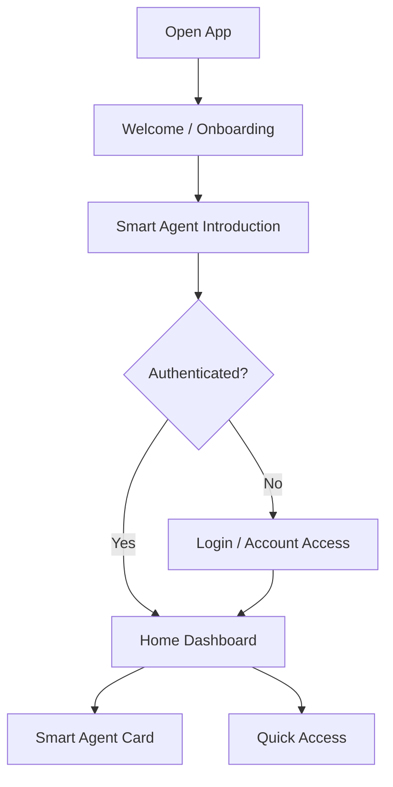
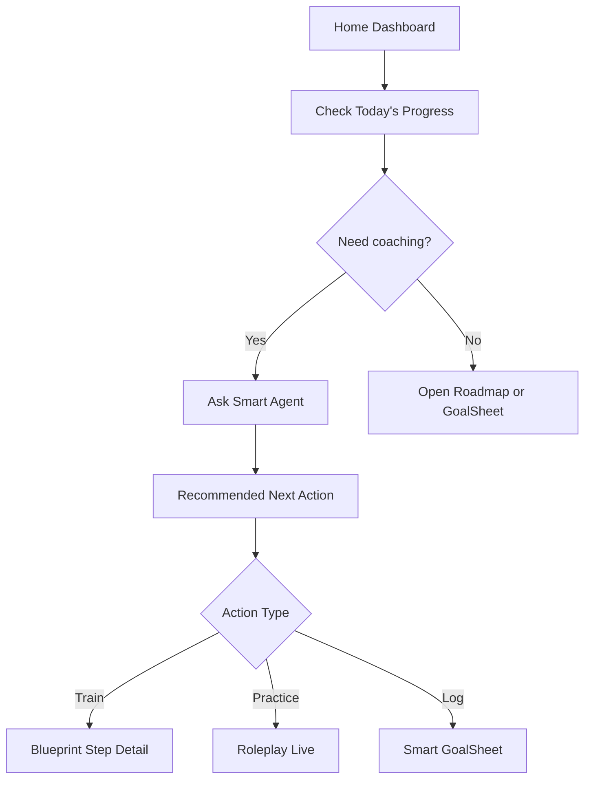
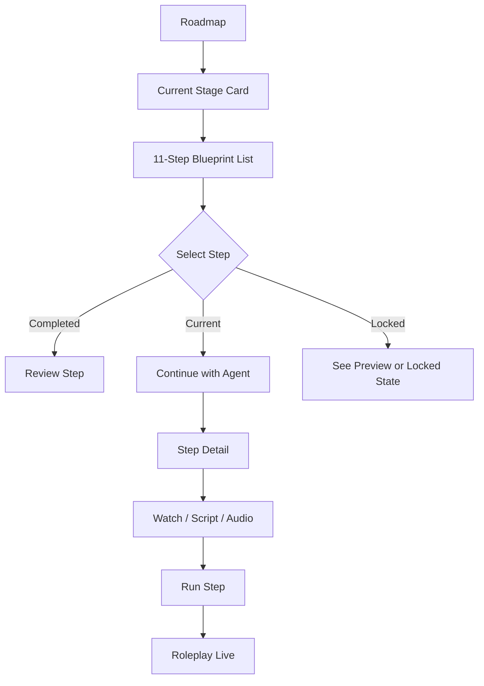
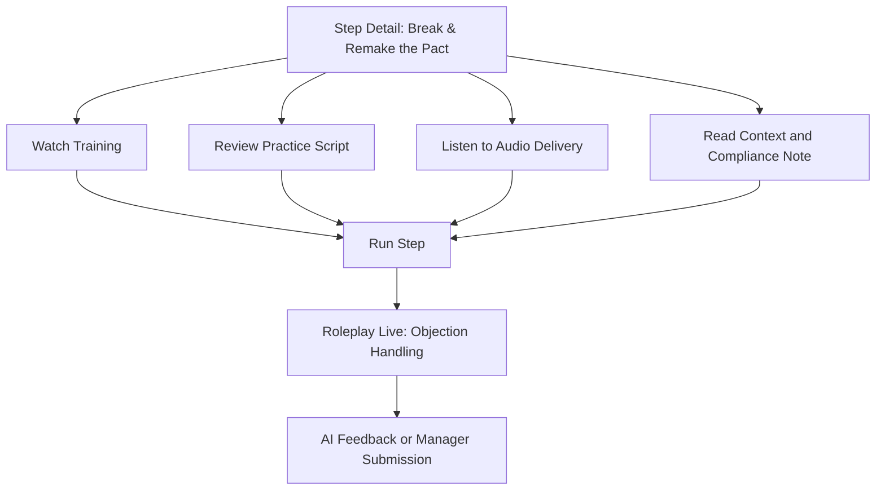
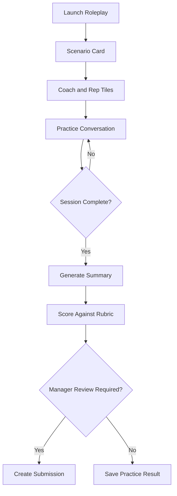
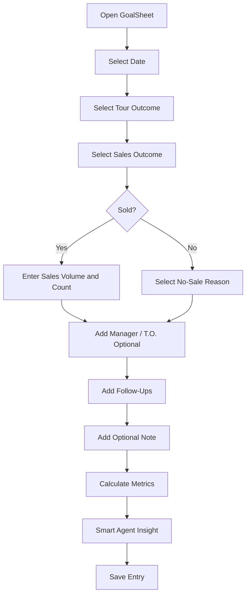
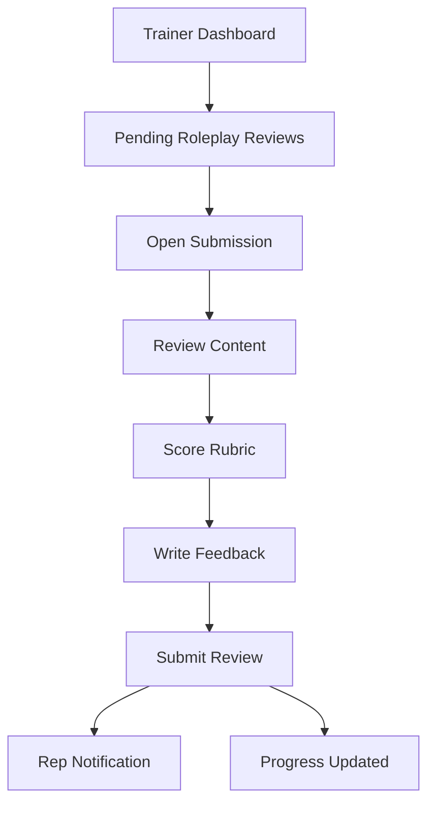
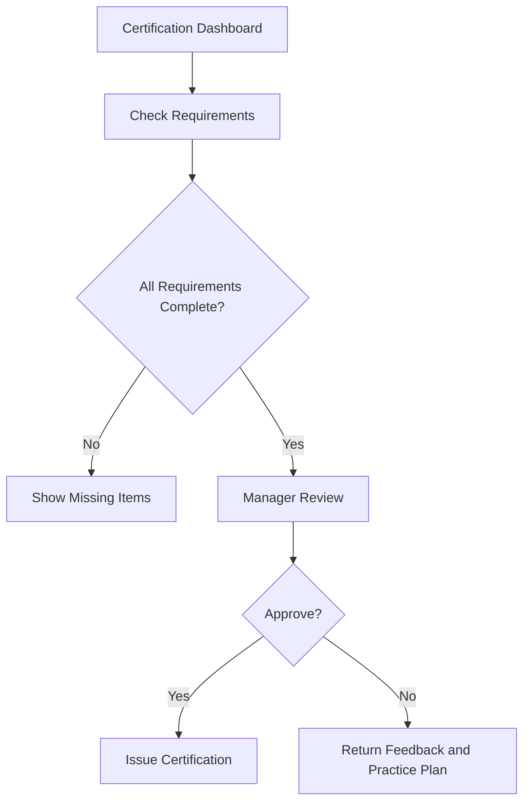
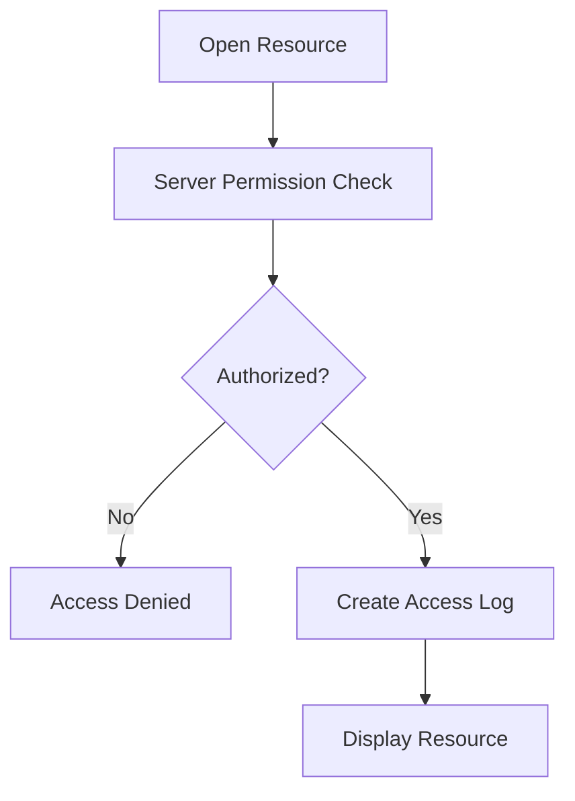
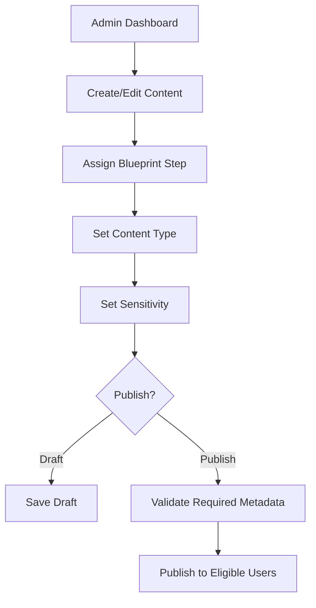

# User Flows

Version: 1.0  
Date: 2026-04-29

## 1. Rep First-Run Flow

Acceptance:

- User understands AI coaching value before entering the app.
- Returning user can skip marketing-style onboarding if session exists.

## 2. Daily Rep Flow

## 3. Roadmap Training Flow

Rules:

- Locked states should not block informational previews unless business policy requires full lock.
- Current step action should prioritize coaching.

## 4. Step 5 Practice Flow

Compliance:

- This flow trains professional commitment setting.
- The app must not frame the step as pressure, manipulation, or misleading urgency.

## 5. Roleplay Live Flow

## 6. Smart GoalSheet Flow

Validation:

- Sales volume must be non-negative numeric.
- If no sale, reason should be prompted.
- Entry date must not create duplicate entries unless edit mode is active.

## 7. Trainer Review Flow

## 8. Certification Flow

## 9. Sensitive Resource Access Flow

## 10. Admin Content Flow

